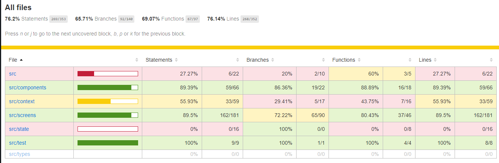

# Blog app with Typescript

### Backend

Backend is created using Express with typescript all the code for express is implemented using decorators. There's a sepearated directory for deocrators which can be used for any Express(TS) project.
For database Sequelize is used with Postgres all the functionality for the sequelize is implemented in Typescript.

##### Note

You must have Postgres installed in your OS in order for backend to function properly.
Instructions to download Postgres can be found [here](https://www.postgresql.org/download/).

### Frontend

Frontend is created using React with typescript.

#### Frontend Outline

- Forms implmementation (Login, Register, and Blog)
- User authetication (auth-context)
- Profile Details (current-user-context)
- @reach/router (To setup all the routes)
- Different states for user (Logged IN/Out)
- Tests (Frontend)
- Code-splitting (coming soon)

### To get started

```shell
# Clone the repo

git clone git@github.com:rakeenali/Blog-Typescript-React.git

# then cd into the cloned repo

cd blog-react-typescript

# install all the dependencies

cd frontend && npm run install
cd backend && npm run install
```

## Runing the app

```shell
# Run both backend and frontend separately

cd frontend && npm run start

cd backend && npm run start
```

## Testing the app

```shell
# Run the tests for the frontend

cd frontend
npm run test
npm run test:coverage
```

##### Coverage Report


